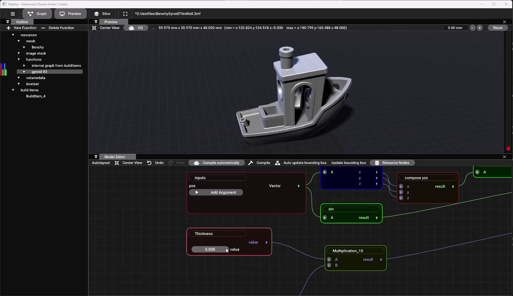
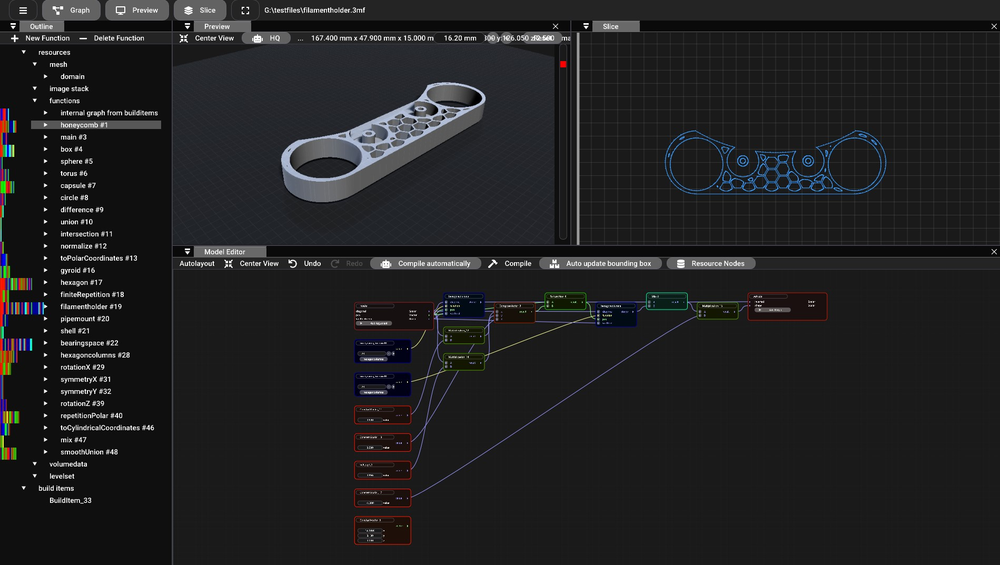

# Gladius


[![Latest Release][def]](https://github.com/3MFConsortium/gladius/releases/latest) is available for download.

<div align="center">
  <a href="https://github.com/3MFConsortium/gladius/releases/latest">
    
  </a>
</div>

#


Gladius is a developement tool used as a playground for the Volumetric Extension of the 3MF file format. It is designed to be a base for processing implicit geometries, especially 3mf files with the volumetric extension, including the implicit namespace. See <https://github.com/3MFConsortium/spec_volumetric> for more information about the volumetric extension.

Gladius can be uses as a library or as a standalone application. It offers a graphical programming interface for designing parts and a rendering engine for visualizing the results. The software is written in C++ and uses OpenCL for the computations. The rendering is done with OpenGL. The software is designed to be easily extensible and can be used as a base for other applications that need to process implicit geometries.

Note: The software is still in an early stage and might contain bugs. The software is provided as is and without any warranty. Use at your own risk.

# Features

- Import and export of 3mf files with volumetric extension
- Edit function graphs
- Create custom functions
- Visualize 3mf files with volumetric extension
- Generate contours

### Import

- 3mf with volumetric extension (as graph using the implicit namespace or using Image3D)

### Export

- 3mf with volumetric extension
- openvdb
- stl
- svg (contours)
- cli (contours)

# API

It offers API bindings for C#, C++ and Python, but additionally bindings could be generated for other languages supported by the Automatic Component Toolkit (<https://github.com/Autodesk/AutomaticComponentToolkit>). The API offers methods for extracting contours and generating meshs and is suited for integation in slicers or other 3D printing software.

# User Interface

The UI is based on the ImGUI library and offers a graphical programming interface for designing parts. The UI is still in an early stage and might be extended in the future.


*Design of a filament spool holder in Gladius.*

# System Requirements

Gladius is designed to run on Windows and Linux, but might run on other platforms as well. The software is tested on Windows 10, 11 and Debian 12 Bookworm. The software requires a OpenCL 1.2 capable GPU and OpenGL for the UI. The software is designed to run on modern hardware and might not work on older systems or systems with outdated drivers or virtual machines with limited GPU support.

# Getting Started

1. Installation process
    See Build and Test
2. Software dependencies
    Gladius needs OpenCL. To be able to build you will propably need to install an OpenCL SDK that is usally provided by GPU vendors. To run the software installing the OpenCL runtime for your GPU should be sufficent. Some vendors (e.g AMD) already include it in the display driver packages. If the target system does not have an OpenCL 1.2 capable GPU you can also install a OpenCL CPU runtime like the one from Intel
    Intel: <https://software.intel.com/en-us/articles/opencl-drivers>
    AMD: <https://rocm.github.io/index.html>
    NVidia: <https://developer.NVidia.com/cuda-toolkit>

# Build

Consider, that there are also binary packages avilable: [![Latest Release][def]](https://github.com/3MFConsortium/gladius/releases/latest)

## Windows

- Install OpenCL SDK (see above)
- Install vcpkg (<https://github.com/Microsoft/vcpkg>)
- Install CMake with the Visual Studio Installer
- Setup Windows Environment Variables:
**VCPKG_DEFAULT_TRIPLET = x64-windows (or your platform accordingly)
** VCPKG_ROOT = Path to your vcpkg installation (required for cmake to find the vcpkg toolchain file)
- clone this repository and update the submodules:

```
git clone https://github.com/3MFConsortium/gladius
cd gladius
git submodule update --init --recursive
```

- Configure and build the project with cmake in a Visual Studio Developer prompt:

```
cd gladius/gladius
mkdir build
cd build
cmake --preset x64-release -S ../
cmake --build .
```

During the configuration process CMake will download and compile the dependencies using vcpkg. This might take a moment.

## Linux

- Install a OpenCL SDK (see above), some distributions provide OpenCL as a package or as part of the display driver
- Install vcpkg (<https://github.com/Microsoft/vcpkg>)
  For debian based distros like Ubuntu you can do
  `apt install git curl zip unzip pkgconfig`
  `git clone https://github.com/microsoft/vcpkg.git`
  `cd vcpkg && ./bootstrap-vcpkg.sh`
  For other distros consult <https://learn.microsoft.com/en-us/vcpkg/concepts/supported-hosts>
- Install CMake and Ninja
- clone this repository and update the submodules:

```
git clone https://github.com/3MFConsortium/gladius
cd gladius
git submodule update --init --recursive
```

* configure and build the project with cmake:

```
# you need to cd again to get into gladius/gladius
cd gladius 
mkdir build
cd build
cmake --preset linux-release -S ../
cmake --build .
```

# Troubleshooting and known Issues

# Windows + slow GPU

Windows restarts the display driver if it doesn't respond in a certain time (2 s by default). This can be changed by two registry values:
<https://www.pugetsystems.com/labs/hpc/Working-around-TDR-in-Windows-for-a-better-GPU-computing-experience-777/>

## Multiple GPUs

The current version just takes the default GPU as OpenCL device or fallbacks to the CPU, if a CPU capable OpenCL runtime is installed. If you have a notebook with an onboard GPU and an additional discrete GPU (e.g Intel HD4xxx + NVidia), the automatic choice might take the slower one. Take a look at ComputeContext.cpp if you want to change that behavior.

# Design your own models

Gladius allows the design of parts using a method that is called Constructive Solid Geometry (CSG). The main idea is to use a few primitives like spheres, cylinder, cubes etc. that you combine to complex parts. For that you use boolean operations like union, intersection and difference.

[def]: https://img.shields.io/github/release/3MFConsortium/gladius.svg
